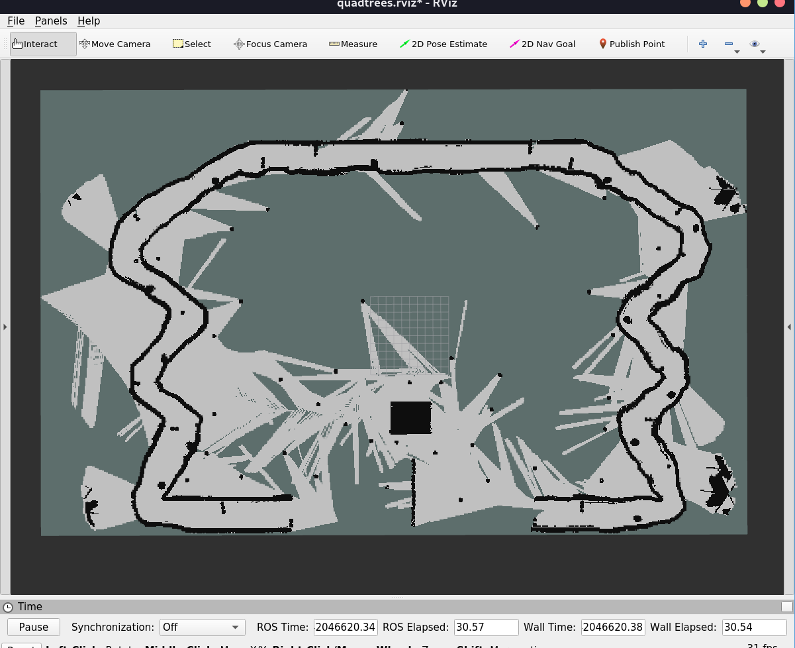
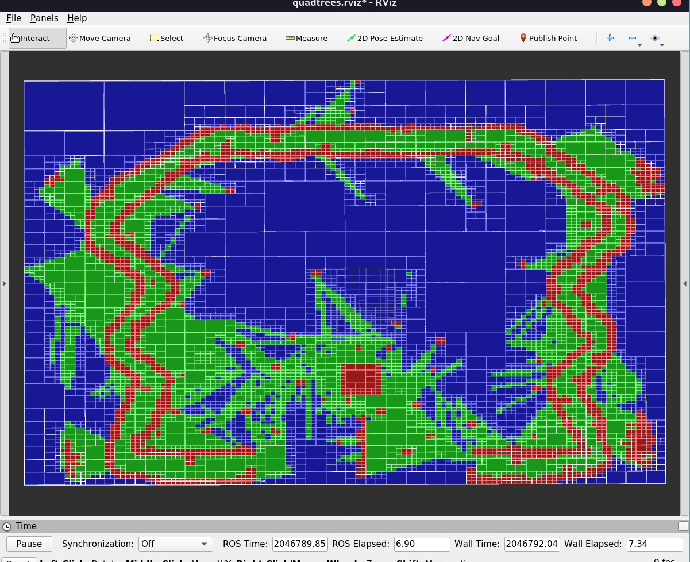
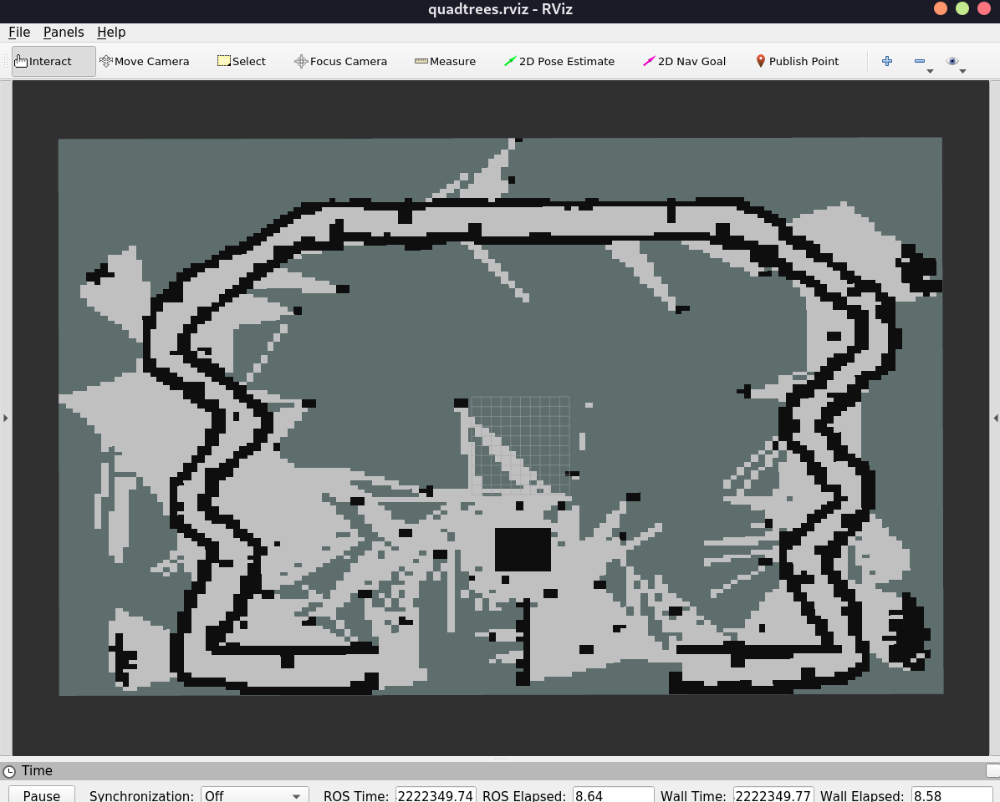

# Quadtree Occupancy Grid for ROS

## Overview
This is a ROS package providing a Quadtree-based representation for 2D occupancy grids in ROS1. It is designed to efficiently manage occupancy data for robotics applications like mapping, path planning, and spatial querying. The Quadtree structure optimizes memory usage and computational efficiency by dynamically partitioning the grid into smaller cells.

### Key Features
- **Adaptive Representation**: Efficient memory usage through a quadtree structure.
- **Dynamic Updates**: Insert data or build occupancy grid dynamically.
- **Spatial Queries**: Query occupied, free, or unknown regions efficiently.
- **Customizable Parameters**: Adjustable tree depth/resolution.

---

## Installation

### Prerequisites
- **ROS1**: Compatible with Noetic distribution.

### Steps
1. Clone this repository into your ROS workspace:
   ```bash
   cd ~/catkin_ws/src
   git clone https://github.com/asmit-mit/quadtrees.git  
   ```
2. Build the package:
   ```bash
   cd ~/catkin_ws
   catkin_make
   ```
3. Source the workspace:
   ```bash
   source ~/catkin_ws/devel/setup.bash
   ```
4. Launch visualization node:
   ```bash
   roslaunch quadtrees quad_tree_viz.launch
   ```

---

## Images
### Side-by-Side Comparison
Here are visual examples comparing a traditional occupancy grid to a quadtree-based occupancy grid:

#### Traditional Occupancy Grid


#### Quadtree Representattion (Max Depth set to 7)


#### Quadtree Occupancy Grid (Max Depth set to 7)

---

## Limitations and Integration

### Limitations
- **No Native ROS Data Structure**: This package does not define its own ROS-specific data structure for the Quadtree representation.
- **No Direct Topic Publishing**: The package does not include functionality to publish the Quadtree structure on a ROS topic for external use.

### Integration
Despite these limitations, the package can be effectively utilized in other ROS packages by including it as a dependency. You can leverage its Quadtree-based occupancy grid representation to enhance your robotics applications by integrating it into your custom pipelines for mapping, path planning, or spatial analysis.

To use this package as a dependency, add it to your `package.xml`:
```xml
<depend>quadtrees</depend>
```

And include it in your `CMakeLists.txt`:
```cmake
find_package(catkin REQUIRED COMPONENTS quadtrees)
```

This enables you to utilize its dynamic Quadtree-based representation within your own ROS nodes and projects.
